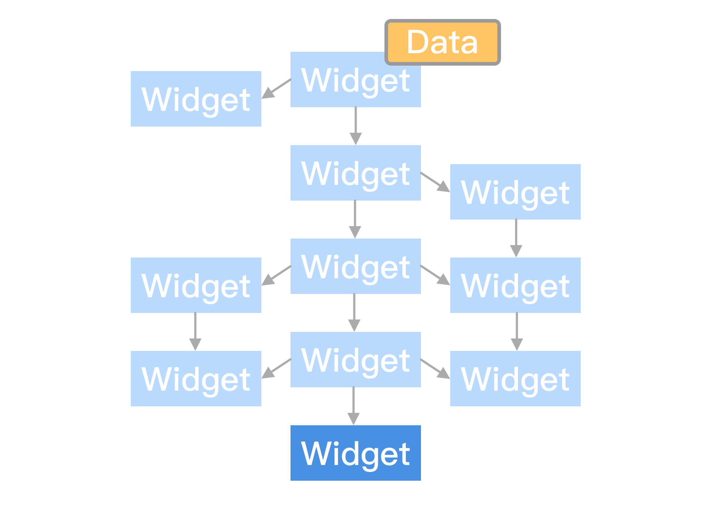
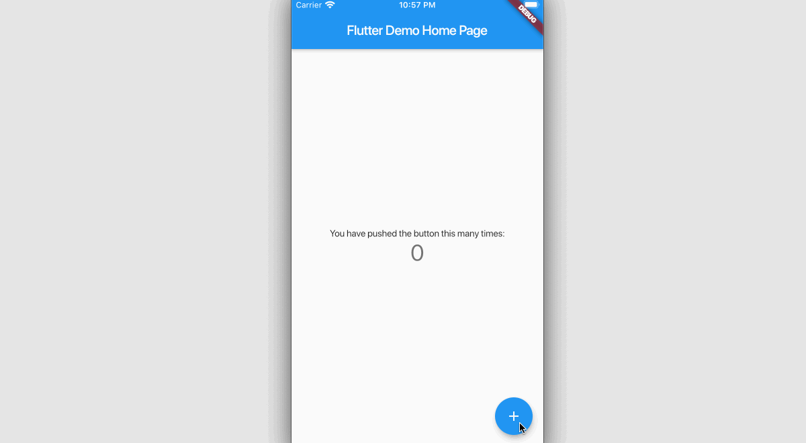

## 前言

Flutter 状态管理内容涉及面广且复杂，上一篇文章 [《Flutter 状态管理 0x00 - 基础知识及 State.setState 背后逻辑》](https://lision.me/flutter-state-management_0x00/) 作为开篇，介绍了在聊 Flutter 状态管理之前需要了解的前置知识点（如：Flutter 如何渲染 Widget），然后通过源码剖析的方式描述了 `State.setState` 背后的逻辑。

相信在读完上一篇文章之后会对 Flutter 渲染 Widget 相关的概念有所了解，对 `State.setState` 是如何更新数据状态并用新的数据重新构建 Widget 有源码级别的认知。

> Note: 如果你还没有阅读上一篇文章且不太清楚这些知识点的话强烈建议先读上一篇文章。

这篇文章将继续围绕 Flutter 状态管理话题，聊一下 Flutter SDK 状态管理相关的类 `InheritedWidget`。

## 索引

- `InheritedWidget` 简介
- `InheritedWidget` 应用情景模拟
- 使用 `InheritedWidget` 实现 IncrementButton
- `InheritedWidget` 实现原理剖析
- `InheritedWidget` 扩展

## `InheritedWidget` 简介


`InheritedWidget` 是 Flutter SDK 中内置的基本类，可以通过它快速高效的在树中传递信息。

开发者可以通过 `BuildContext.inheritFromWidgetOfExactType` 拿到当前节点下最接近的指定类型的 Widget，时间复杂度一般情况下为 `O(1)`。

> Inherited widgets, when referenced in this way, will cause the consumer to rebuild when the inherited widget itself changes state. 译为“如果通过 `BuildContext.inheritFromWidgetOfExactType` 这种方式引用得到 `InheritedWidget` 则会在 `InheritedWidget` 发生状态变更时通知引用方 `rebuild`。”比较合理，但其实这么理解是有坑的，后面再说。

> Note: 截至笔者在写本文时，Flutter 官网 Widget 文档 https://api.flutter.dev/flutter/widgets/InheritedWidget-class.html 内部 `InheritedWidget` 下面的描述方法还是 `BuildContext.dependOnInheritedWidgetOfExactType`，疑似文档过时没有得到及时更新。源码文件的注释是更新了的，所以还是推荐大家在开发过程中直接查阅源码。

## `InheritedWidget` 应用情景模拟



如图所示，假设当前最底部的深蓝色 Widget 需要访问顶部 Widget 的 Data，此时难道需要我们一层层的将 Data 作为入参逐层传递吗？当然这么做肯定是可以实现的，但是有种说不出来的 Low。因为沿途 Widget 不一定都需要访问顶部 Widget 的 Data，所以他们根本不应该插手参与传递的事。

这种场景下就可以使用 Flutter SDK 内置的 `InheritedWidget` 来解决这个问题了。

> Emmmmm...如果你想问为什么会出现上图的情景的话，可以想一下如果所有 Widget 写在一起的 Flutter 代码，当业务和相关 UI 有一定复杂度时估计后面一屏幕都是右括号了。

> Emmmmm...你可能还想问为啥 Data 在顶部，不能让 Data 下来一点吗？比如造个 Data 的副本直接放到底部的 Widget 这样子。这就违反了单一数据源原则，通俗点说就是当你这么做之后需要额外花费精力维护这些 Data 副本之间的数据同步。

## 使用 `InheritedWidget` 实现 IncrementButton



> Note: [相关代码 REPO 地址](https://github.com/Lision/flutter_state_manage_demos/tree/master/inherited_widget)，不出意外的话里面应该会放置关于 Flutter 状态管理这一话题相关文章的所有 Demo。

Emmmmm...使用 `InheritedWidget` 来实现 IncrementButton 这种官方默认的简单 Demo 其实有点简单事复杂做的感觉。不过这里主要考虑的点还是读者对于这个 Demo 更熟悉，不用重新模拟业务场景费劲代入，也不用让大家费神看太多陌生的代码。

首先假设原来 IncrementButton Demo 的 UI 很复杂（我知道就这种想象力要求你们肯定可以的），对应的 Flutter Widget 代码嵌套太多了，为了代码可读性和可维护性我们把原 IncrementButton 中 `_MyHomePageState.build` 方法内部描述 Widget 的代码拆了出来。

``` dart
class _MyHomePageState extends State<MyHomePage> {
  int counter = 0;

  void incrementCounter() {
    setState(() {
      counter++;
    });
  }

  @override
  Widget build(BuildContext context) {
    return InheritedCounter(
      data: this,
      child: Scaffold(
        appBar: AppBar(
          title: Text(widget.title),
        ),
        body: IncrementBody(),
        floatingActionButton:
            IncrementButton(), // This trailing comma makes auto-formatting nicer for build methods.
      ),
    );
  }
}
```

注意，上面的代码中 `_MyHomePageState.build` 返回的 Widget 在原来 `Scaffold` 的基础上套了一层 `InheritedCounter`，对应上面的代码：

- `Scaffold.body` 拆出并命名为 `IncrementBody`。
- `Scaffold.floatingActionButton` 拆出并命名为 `IncrementButton`。

``` dart
class IncrementBody extends StatelessWidget {
  @override
  Widget build(BuildContext context) {
    return Center(
      child: Column(
        mainAxisAlignment: MainAxisAlignment.center,
        children: <Widget>[
          Text(
            'You have pushed the button this many times:',
          ),
          Text(
            '${InheritedCounter.of(context).data.counter}',
            style: Theme.of(context).textTheme.display1,
          ),
        ],
      ),
    );
  }
}

class IncrementButton extends StatelessWidget {
  @override
  Widget build(BuildContext context) {
    return FloatingActionButton(
      onPressed: InheritedCounter.of(context).data.incrementCounter,
      tooltip: 'Increment',
      child: Icon(Icons.add),
    );
  }
}
```

细心的读者应该已经发现之前 Widget 描述中使用到的 `_MyHomePageState` 内部的属性和方法都已经被替换为了 `InheritedCounter.of(context).data.xxx` 了，这是因为拆分 Widget 之后我们拆出来的 `IncrementBody` 与 `IncrementButton` 是无法访问到 `_MyHomePageState` 相关的信息的。

这里面 `InheritedCounter` 就是我们在 `_MyHomePageState.build` 方法返回的 Widget，它继承自 `InheritedWidget`。

``` dart
class InheritedCounter extends InheritedWidget {
  const InheritedCounter({
    Key key,
    @required this.data,
    @required Widget child,
  })  : assert(child != null),
        super(key: key, child: child);

  final _MyHomePageState data;

  static InheritedCounter of(BuildContext context) =>
      context.inheritFromWidgetOfExactType(InheritedCounter);

  @override
  bool updateShouldNotify(InheritedCounter old) => data.counter != old.data.counter;
}
```

其中 `InheritedCounter.of(context)` 实际上就是调用了 `context.inheritFromWidgetOfExactType`。参见 前面「`InheritedWidget` 简介」章节下介绍的内容，可以通过此方法找到最近接当前节点的指定类型的 Widget，此时指定的 `Type` 入参为 `InheritedCounter`。

`InheritedCounter.data` 就是 `_MyHomePageState`，所以上面 `InheritedCounter.of(context).data.xxx` 的逻辑为：

- 通过 `context.inheritFromWidgetOfExactType(InheritedCounter)` 找到最接近的类型为 `InheritedCounter` 的祖先节点，此 Demo 里面对应 `_MyHomePageState.build` 返回的 `InheritedCounter` 实例。
- 通过 `InheritedCounter.state` 拿到 `_MyHomePageState` 执行后续逻辑。

至此，我们就成功通过 `InheritedWidget` 从子 Widget 成功访问到的祖先节点 `InheritedCounter` 的数据了。

> Note: `InheritedWidget.updateShouldNotify` 方法可以通过返回 `bool` 来决定本次更新是否需要对依赖 `context.inheritFromWidgetOfExactType` 拿到 `InheritedWidget` 的使用方发起通知。

接着，我们来聊聊「`InheritedWidget` 简介」里面说过的关于官方注释的坑。当时看完注释我以为 `InheritedWidget` 里面的数据变更后就会通知调用 `context.inheritFromWidgetOfExactType` 引用此 `InheritedWidget` 的调用放 `rebuild`，但实际上是不会的。Demo 中 `IncrementBody` 之所以能够 `rebuild` 刷新 UI 显示完全是因为 `_MyHomePageState.build`，换言之如果没有 `_MyHomePageState.setState` 触发 `_MyHomePageState.build` 无论 `InheritedWidget` 内部的数据如何变更都是不能触发引用方 `rebuild` 的。

## `InheritedWidget` 实现原理剖析

